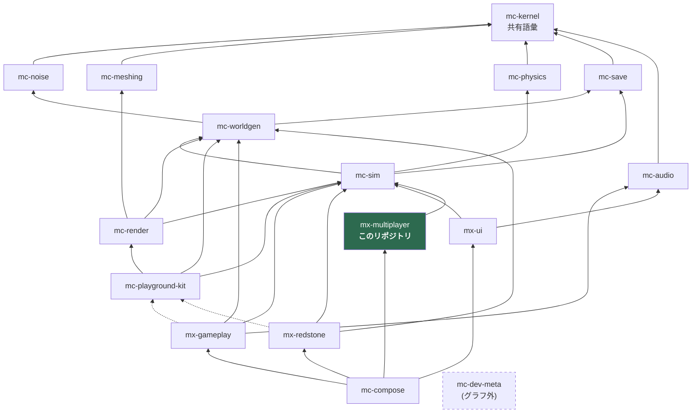

# アーキテクチャ

## 1. 4 階層アーキテクチャ

plan.md §2.2 の 4 階層。16 リポジトリはすべてこのいずれかに属する。

| 階層 | リポジトリ | 性質 |
| --- | --- | --- |
| 安定ライブラリ | mc-kernel / mc-noise / mc-meshing / mc-physics / mc-save / mc-audio | 純粋関数・狭い界面・変更頻度が低い。相互独立で並行構築可能 |
| 基盤 | mc-worldgen / mc-sim / mc-render / mc-playground-kit | 状態とサービス(**名詞**)。体験モジュールが乗る土台 |
| 体験モジュール | mx-gameplay / mx-redstone / mx-ui / **mx-multiplayer** | ルールと UI(**動詞**)。互いを知らず、基盤サービス経由でのみ会話する |
| 合成 | mc-compose | Layer マージ + stage 順序表 + E2E。ロジックを持たない |
| (グラフ外) | mc-dev-meta | 開発時ワークスペース束ね役。ゲームグラフには参加しない |

**mx-multiplayer は第 3 階層(体験モジュール)である。**

## 2. 依存グラフ(16 リポジトリ全体)

実線 = 実行時依存(`dependencies`)、点線 = プレビュー起動時のみ(`devDependencies`)。
`mc-kernel` はどこからでも import 可能なため、エッジとしては描かず注記に留める。



> **mc-kernel は全リポジトリから import 可能。** グラフに描かないのは、
> 全ノードから kernel へエッジを引くと図が読めなくなるためと、
> `scripts/check-dependency-whitelist.ts` が `dependencyGraph` に kernel を書くことを
> 設定エラーとして拒否するため(rule 4)。ただし `package.json` への記載は必要。

## 3. このリポジトリの位置

**mx-multiplayer の実行時依存は `@nerima-games/mc-sim` ただ 1 つ。**

その 1 本しかないことが設計そのものである。

- **上流(mc-sim)へ**: リモートピアの行動を世界に反映するときは、必ず mc-sim のサービス
  (`InventoryService` / `EntityManager` 等)に書き込む。mx-gameplay を呼ぶことは決してない。
- **下流(mc-compose)へ**: `GameModule` として Layer と `StageRegistration` を公開する。
  mc-compose はそれをマージするだけで、順序制約(`after`)以外の指示は受けない。
- **横(mx-ui / mx-gameplay / mx-redstone)へ**: エッジはゼロ。サーバ一覧画面もロスター表示も
  mx-ui の所有物であり、こちらからは触らない。

### 到達できるが import してはいけないもの

`pnpm install` すると `node_modules` には mc-physics も mc-worldgen も mc-save も物理的に存在する
(mc-sim の推移的依存として)。**それらを import することは禁止**である。

```
mx-multiplayer -> mc-sim -> mc-physics   ... mc-physics の import は transitive-import 違反
```

`pnpm check:deps` が `transitive-import` として非ゼロ終了する。
「推移的依存は import ライセンスではない」— 16 リポジトリ分割が静かにモノリスへ戻る唯一の経路がこれである。

## 4. 設計ルール

### 4.1 基盤 = 名詞、体験 = 動詞(plan.md §2.3-1)

| | 置き場 | 例 |
| --- | --- | --- |
| **名詞**(状態の置き場・サービス) | 基盤(mc-sim / mc-worldgen / mc-render) | `InventoryService`、`EntityManager`、`ChunkManager` |
| **動詞**(ルール・振る舞い) | 体験モジュール(mx-*) | 「掘ったらドロップする」「リモートピアの移動を反映する」 |

mx-multiplayer にとってこれは次を意味する:

- **持ってよい**: 「PlayerMove フレームを受け取ったらリモートプレイヤーの位置を更新する」という**動詞**
- **持ってはいけない**: リモートプレイヤーの位置そのものという**名詞**。それは mc-sim の `EntityManager` が持つ

体験モジュール間の依存エッジは**ゼロ**である。
「リモートピアがブロックを壊した → インベントリにアイテムが入る」は、
mx-multiplayer → mx-gameplay の呼び出しではなく、mc-sim の `InventoryService` を経由して実現する。

### 4.2 mc-playground-kit は devDependency 専用(plan.md §2.3-2)

`mc-playground-kit` は「ミニ平地ワールド + カメラ + レンダラ + 入力を 1 秒で束ねる糊」であり、
**プレビュー(dev アプリ)からのみ使う**。

`dependencies` に入れてはならない理由は具体的である:
**実行時入力サービスの所有者は mc-render であり、kit ではない**(plan.md §2.3-2)。
kit を実行時依存にすると、出荷ビルドが「同梱されないハーネス」から入力を取ることになり、
リリースビルドから入力処理が丸ごと消える。

強制は 2 段構え:

1. `scripts/check-dependency-whitelist.ts` の `DEV_ONLY_PACKAGES` が
   `dependencies` への出現を `dev-only-package-in-dependencies` として拒否
2. 出荷ソース(`index.ts` / `domain/`)からの import を
   `dev-only-package-in-shipped-source` として拒否

なお **mx-multiplayer は kit を devDependency としても使わない**。
プレビューを持つのは mx-gameplay と mx-redstone であり、こちらの検証はループバックで完結する
([testing.md](./testing.md) 参照)。

### 4.3 stage 実行順序表は mc-compose が唯一所有(plan.md §2.3-3)

mx-multiplayer は `StageRegistration.after` で**順序制約を宣言するだけ**である。
全順序を決めるのは mc-compose だけであり、こちらが
「自分は render の前に走る」といったグローバルな知識を持つことはない。

### 4.4 依存ホワイトリストは CI で強制(plan.md §2.3-5)

`pnpm check:deps` は違反があれば必ず非ゼロ終了する。
参照実装の `check-package-dag.ts` は警告を出して常に 0 で終了していた
— 落ちないゲートはドキュメントであってゲートではない。
